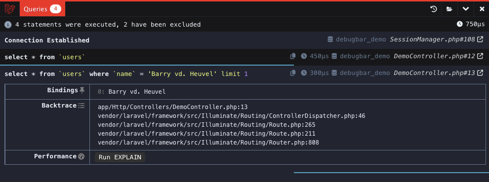

---
hide:
  - navigation
---
!!! warning

    Debugbar can slow the application down (because it has to gather and render data). So when experiencing slowness, try disabling some of the collectors.

## Collectors

This package includes some custom collectors:

- [QueryCollector](#querycollector): Show all queries, including binding + timing
- RouteCollector: Show information about the current Route.
- [ViewCollector](#viewcollector): Show the currently loaded views. (Optionally: display the shared data)
- EventsCollector: Show all events
- LaravelCollector: Show the Laravel version and Environment. (disabled by default)
- SymfonyRequestCollector: replaces the RequestCollector with more information about the request/response
- LogsCollector: Show the latest log entries from the storage logs. (disabled by default)
- FilesCollector: Show the files that are included/required by PHP. (disabled by default)
- ConfigCollector: Display the values from the config files. (disabled by default)
- CacheCollector: Display all cache events. (disabled by default)

Bootstraps the following collectors for Laravel:

- LogCollector: Show all Log messages
- SymfonyMailCollector for Mail

And the default collectors:

- PhpInfoCollector
- MessagesCollector
- [TimeDataCollector](#timeline-collector) (With Booting and Application timing)
- MemoryCollector
- ExceptionsCollector


To enable or disable any of the collectors, set the configuration to `true` or `false`. Some collector have additional options in the configuration:

<details><summary>debugbar.php</summary>

```php

   /*
     |--------------------------------------------------------------------------
     | DataCollectors
     |--------------------------------------------------------------------------
     |
     | Enable/disable DataCollectors
     |
     */

    'collectors' => [
        'phpinfo'         => true,  // Php version
        'messages'        => true,  // Messages
        'time'            => true,  // Time Datalogger
        'memory'          => true,  // Memory usage
        'exceptions'      => true,  // Exception displayer
        'log'             => true,  // Logs from Monolog (merged in messages if enabled)
        'db'              => true,  // Show database (PDO) queries and bindings
        'views'           => true,  // Views with their data
        'route'           => true,  // Current route information
        'auth'            => false, // Display Laravel authentication status
        'gate'            => false,  // Display Laravel Gate checks
        'session'         => true,  // Display session data
        'symfony_request' => true,  // Only one can be enabled..
        'mail'            => false,  // Catch mail messages
        'laravel'         => false, // Laravel version and environment
        'events'          => false, // All events fired
        'default_request' => false, // Regular or special Symfony request logger
        'logs'            => false, // Add the latest log messages
        'files'           => false, // Show the included files
        'config'          => false, // Display config settings
        'cache'           => false, // Display cache events
        'models'          => false,  // Display models
        'livewire'        => true,  // Display Livewire (when available)
        'jobs'            => false, // Display dispatched jobs
        'pennant'         => false, // Display Pennant feature flags
    ],

    


```

</details>

### QueryCollector

The Query Collector has the following features
 - Show the executed queries including timing
 - Show/mark duplicate queries
 - Show used parameters
 - Run on-demand 'EXPLAIN' queries and link to Visual Explain  (disabled bu default)
 - Copy the query to clipboard
 - Show the source of the query and open in editor
 - Visualize the duration of the queries with bottom border
 - Add queries to the timeline (disabled by default)
 - Limit the number of queries to avoid slowing down the Debugbar.
 - Exclude paths (eg. for session or vendors)
 - Show memory usage (disabled by default)



```php
  'options' => [
        // ...
        'db' => [
            'with_params'       => true,   // Render SQL with the parameters substituted
            'exclude_paths'     => [       // Paths to exclude entirely from the collector
                // 'vendor/laravel/framework/src/Illuminate/Session', // Exclude sessions queries
            ],
            'backtrace'         => true,   // Use a backtrace to find the origin of the query in your files.
            'backtrace_exclude_paths' => [],   // Paths to exclude from backtrace. (in addition to defaults)
            'timeline'          => false,  // Add the queries to the timeline
            'duration_background'  => true,   // Show shaded background on each query relative to how long it took to execute.
            'explain' => [                 // Show EXPLAIN output on queries
                'enabled' => false,
            ],
            'hints'             => false,   // Show hints for common mistakes
            'show_copy'         => true,    // Show copy button next to the query,
            'slow_threshold'    => false,   // Only track queries that last longer than this time in ms
            'memory_usage'      => false,   // Show queries memory usage
            'soft_limit'       => 100,      // After the soft limit, no parameters/backtrace are captured
            'hard_limit'       => 500,      // After the hard limit, queries are ignored
        ],
        // ...
    ],
```

### Timeline Collector


```php
    'options' => [
        'time' => [
            'memory_usage' => false,  // Calculated by subtracting memory start and end, it may be inaccurate
        ],
    ]
```

### ViewCollector

The ViewCollector shows views and has the following features:

 - Show used templates and source
 - Optionally add them to the timeline
 - Group similar views (useful for components)
 - Exclude folders (eg. for Filament or other vendors)
 - Optionally show data (this can be resource heavy)


```php
    'options' => [
        'views' => [
            'timeline' => false,    // Add the views to the timeline (Experimental)
            'data' => false,        //true for all data, 'keys' for only names, false for no parameters.
            'group' => 50,          // Group duplicate views. Pass value to auto-group, or true/false to force
            'exclude_paths' => [    // Add the paths which you don't want to appear in the views
                'vendor/filament'   // Exclude Filament components by default
            ],
        ],
    ]

```
## Additional options

```php
/*
     |--------------------------------------------------------------------------
     | Extra options
     |--------------------------------------------------------------------------
     |
     | Configure some DataCollectors
     |
     */

    'options' => [
        'time' => [
            // See above
        ],
        'messages' => [
            'trace' => true,   // Trace the origin of the debug message
        ],
        'memory' => [
            'reset_peak' => false,     // run memory_reset_peak_usage before collecting
            'with_baseline' => false,  // Set boot memory usage as memory peak baseline
            'precision' => 0,          // Memory rounding precision
        ],
        'auth' => [
            'show_name' => true,   // Also show the users name/email in the debugbar
            'show_guards' => true, // Show the guards that are used
        ],
        'db' => [
            // See above        
        ],
        'mail' => [
            'timeline' => false,  // Add mails to the timeline
            'show_body' => true,
        ],
        'views' => [
            // See above
        ],
        'route' => [
            'label' => true,  // show complete route on bar
        ],
        'session' => [
            'hiddens' => [], // hides sensitive values using array paths
        ],
        'symfony_request' => [
            'hiddens' => [], // hides sensitive values using array paths, example: request_request.password
        ],
        'events' => [
            'data' => false, // collect events data, listeners
        ],
        'logs' => [
            'file' => null,
        ],
        'cache' => [
            'values' => true, // collect cache values
        ],
    ],

```