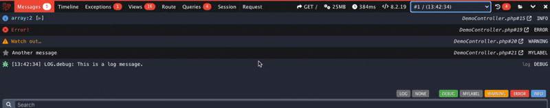

---
hide:
  - navigation
---

## Collectors

See the [Collectors page](collectors.md) for available collectors.

## AJAX Requests

Laravel Debugbar tracks AJAX/XHR request in your application. You can open these in the dropdown menu, or click the history button to show the requests.

Tip: you can disable he 'autoshow' toggle in the history tab to keep the current dataset active, instead of switching.



<details><summary>config/debugbar.php</summary>

```php
/*
 |--------------------------------------------------------------------------
 | Capture Ajax Requests
 |--------------------------------------------------------------------------
 |
 | The Debugbar can capture Ajax requests and display them. If you don't want this (ie. because of errors),
 | you can use this option to disable sending the data through the headers.
 |
 | Optionally, you can also send ServerTiming headers on ajax requests for the Chrome DevTools.
 |
 | Note for your request to be identified as ajax requests they must either send the header
 | X-Requested-With with the value XMLHttpRequest (most JS libraries send this), or have application/json as a Accept header.
 |
 | By default `ajax_handler_auto_show` is set to true allowing ajax requests to be shown automatically in the Debugbar.
 | Changing `ajax_handler_auto_show` to false will prevent the Debugbar from reloading.
 */

'capture_ajax' => true,
'add_ajax_timing' => false,
'ajax_handler_auto_show' => true,
'ajax_handler_enable_tab' => true,

```

</details>

## History browser

By default, Debugbar stores request history. This is useful for non-browser requests, redirects or external requests. You can open it with the 'folder' button (3rd from the right).

With the default settings, storage is only visible from your local IP. To enable browsing the history, change the `storage.open` setting or `DEBUGBAR_OPEN_STORAGE` env key.

!!! warning

    Do not open the history outside your local environment, to avoid leaking credentials or sensitive data.


<details><summary>config/debugbar.php</summary>

```php
    /*
     |--------------------------------------------------------------------------
     | Storage settings
     |--------------------------------------------------------------------------
     |
     | DebugBar stores data for session/ajax requests.
     | You can disable this, so the debugbar stores data in headers/session,
     | but this can cause problems with large data collectors.
     | By default, file storage (in the storage folder) is used. Redis and PDO
     | can also be used. For PDO, run the package migrations first.
     |
     | Warning: Enabling storage.open will allow everyone to access previous
     | request, do not enable open storage in publicly available environments!
     | Specify a callback if you want to limit based on IP or authentication.
     | Leaving it to null will allow localhost only.
     */
    'storage' => [
        'enabled'    => true,
        'open'       => env('DEBUGBAR_OPEN_STORAGE'), // bool/callback.
        'driver'     => 'file', // redis, file, pdo, socket, custom
        'path'       => storage_path('debugbar'), // For file driver
        'connection' => null,   // Leave null for default connection (Redis/PDO)
        'provider'   => '', // Instance of StorageInterface for custom driver
        'hostname'   => '127.0.0.1', // Hostname to use with the "socket" driver
        'port'       => 2304, // Port to use with the "socket" driver
    ],
```

</details>

## Editor integration

Debugbar can open links to views, exception, routes etc in your Editor directly, if you set this up correctly. By default this should just work for PHPStorm on local development. You can change your editor by setting `DEBUGBAR_EDITOR` or the config.
If your working in a remote host or docker, you can change the mapping between remote and local paths.


<details><summary>config/debugbar.php</summary>

```php
/*
    |--------------------------------------------------------------------------
    | Editor
    |--------------------------------------------------------------------------
    |
    | Choose your preferred editor to use when clicking file name.
    |
    | Supported: "phpstorm", "vscode", "vscode-insiders", "vscode-remote",
    |            "vscode-insiders-remote", "vscodium", "textmate", "emacs",
    |            "sublime", "atom", "nova", "macvim", "idea", "netbeans",
    |            "xdebug", "espresso"
    |
    */

    'editor' => env('DEBUGBAR_EDITOR') ?: env('IGNITION_EDITOR', 'phpstorm'),

    /*
    |--------------------------------------------------------------------------
    | Remote Path Mapping
    |--------------------------------------------------------------------------
    |
    | If you are using a remote dev server, like Laravel Homestead, Docker, or
    | even a remote VPS, it will be necessary to specify your path mapping.
    |
    | Leaving one, or both of these, empty or null will not trigger the remote
    | URL changes and Debugbar will treat your editor links as local files.
    |
    | "remote_sites_path" is an absolute base path for your sites or projects
    | in Homestead, Vagrant, Docker, or another remote development server.
    |
    | Example value: "/home/vagrant/Code"
    |
    | "local_sites_path" is an absolute base path for your sites or projects
    | on your local computer where your IDE or code editor is running on.
    |
    | Example values: "/Users/<name>/Code", "C:\Users\<name>\Documents\Code"
    |
    */

    'remote_sites_path' => env('DEBUGBAR_REMOTE_SITES_PATH'),
    'local_sites_path' => env('DEBUGBAR_LOCAL_SITES_PATH', env('IGNITION_LOCAL_SITES_PATH')),

```

</details>

## Configuraton

### Custom features { #custom }

Custom features or collectors are not enabled by default, but can be enabled by enabling the configuration setting.
This is usually because the target audience of a feature is not large enough.

### Configurable options { #config }

Configurable features are not enabled by default, but can be enabled. This is usually because the target audience of a feature is not large enough.
You can enable the feature by changing the mentioned value in [config/debugbar.php](https://github.com/barryvdh/laravel-debugbar/blob/master/config/debugbar.php) after [publishing the config](installation.md#publish-config).

### Experimental Features  { #experimental }

Some features are marked as 'Experimental'. This mostly means the feature is new and not enabled by default, but might become enable by default in the future.
You are welcome to test this feature and report any issues. 

