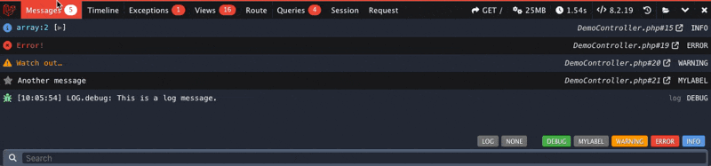

# Laravel Debugbar

Laravel Debugbar is a package that integrates [PHP Debug Bar](https://github.com/php-debugbar/php-debugbar) with Laravel to debug [database queries](collectors.md#db) and [profile other information](collectors.md).

!!! tip "Live Demo"
    See an interactive example of the Laravel Debugbar in action below. (Don't worry, this is just dummy data)

[Get started](installation.md){ .md-button .md-button--primary } [View code :material-github:](https://github.com/barryvdh/laravel-debugbar){ .md-button }